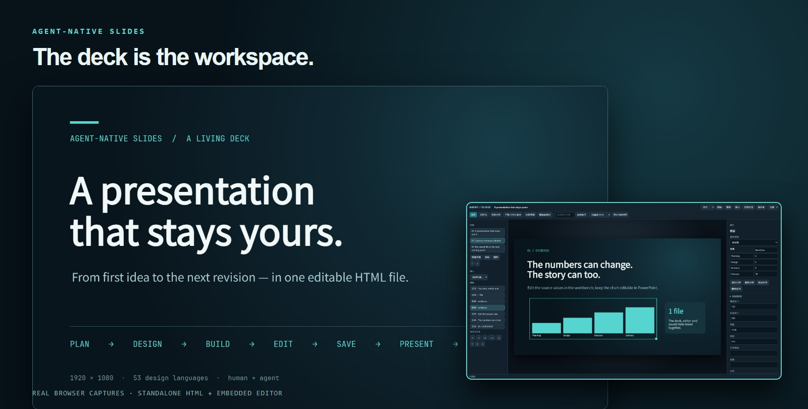
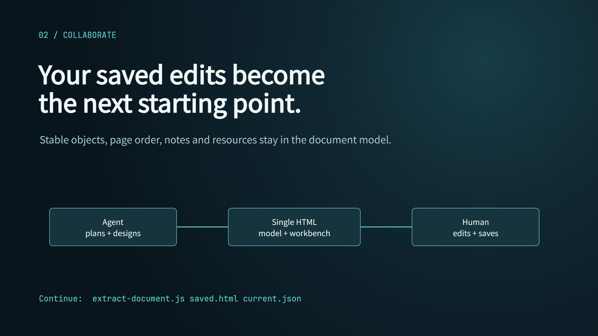
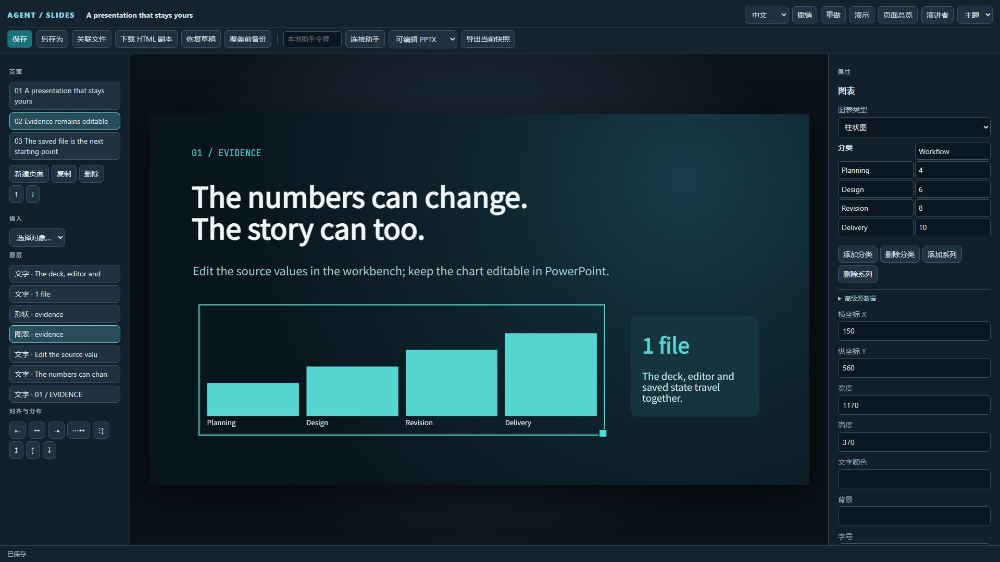
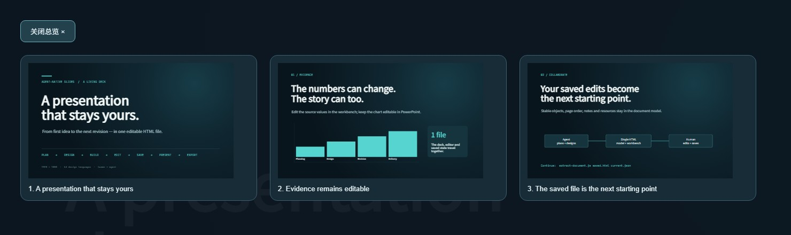
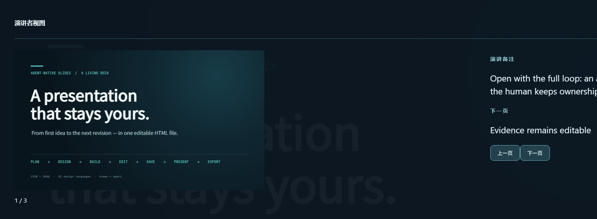
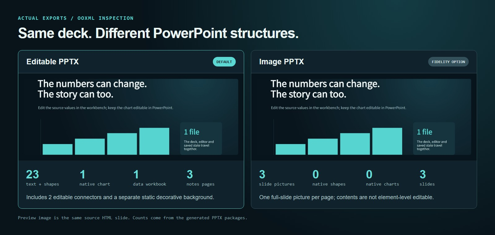

<div align="center">

# Agent-Native Slides

**An agent plans and designs the deck. You edit the delivered file. The next AI revision starts from what you saved.**

53 design languages · one portable HTML deck · embedded workbench · PDF · editable PowerPoint

[中文](README.zh-CN.md) · [Try the standalone demo](examples/workflow.html) · [Explore all 53 styles](docs/style-gallery.md) · [Object and export details](docs/editable-workbench.md)



<sub>Two real browser captures of the <a href="examples/workflow.html">included workflow deck</a>. The editor is inside the same HTML file.</sub>

</div>

## A presentation is a continuing collaboration

The agent uses a claim-and-evidence plan, a chosen design language, and a versioned object document to build a **standalone 1920 × 1080 HTML deck**. Open that file to present or to change pages, objects, data, and notes in the embedded workbench. Save the edited HTML; it becomes the source for the next agent pass and for exports.

| Step | What happens | What persists |
| --- | --- | --- |
| **Plan → design** | Turn source material into slide claims and evidence; compare live previews before choosing a style. | Deck Plan and design decisions. |
| **Build → validate** | Author editable objects and package the runtime, fonts, resources, and workbench into one HTML file. | Stable page and object IDs in the document model. |
| **Edit → save** | Change content, chart data, layout properties, notes, and page order in the delivered HTML. | The saved HTML, with draft recovery and conflict checks. |
| **Present → export** | Navigate, use overview or speaker notes, print PDF, or export PowerPoint. | PDF; native editable PPTX by default; a separate image PPTX for fidelity. |
| **Continue with AI** | Extract the document from the **user-saved** HTML and revise it. | The user's edits remain the starting point. |

The style defines the slide design; the workbench is a fixed editing interface. It does not impose a fixed slide template.



<sub>Slide 3 of the included standalone deck. Its diagram nodes, labels, and connections are editable objects.</sub>

## See it working

### Edit the file you hand over



The screenshot shows the real [standalone example](examples/workflow.html) with a chart selected. The workbench now opens in **Simplified Chinese**, with an English UI switch that leaves slide content untouched. The page rail, zoomable canvas, layers, properties, notes, undo/redo, file history and export tasks are bundled into the HTML. Drag, resize, align and group absolute objects; use direct cells, data grids and node/connection controls for tables, charts and diagrams. Text, code, formula source, images, shapes and connectors have their own editors. Unknown content types fail build validation. [See the per-object capability matrix and limits.](docs/editable-workbench.md)

**Saving has explicit states.** In a browser with the File System Access API, authorize a target and use `Ctrl+S` to write it. Other browsers can download a new editable HTML copy; the original is unchanged. IndexedDB holds local drafts and the latest pre-overwrite backup. Optional Git history uses a token-protected local helper bound to one selected HTML file, with manual versions and an off-by-default idle auto-version switch. It stores history outside the deck; the saved HTML remains the next agent input. [Saving and history guide.](docs/editable-workbench.md#saving-and-history)

### Keep the design freedom


**53 styles across 15 families**, each with design rules and a runnable three-slide preview. The current [font policy](docs/font-audit.md) pairs a distinct display and body face with bundled CJK and offline fallbacks. Open the [full gallery](docs/style-gallery.md) for three current captures, live previews, typography, and design rules for every style. These previews are design references; the generated object deck is composed for its own content.

<details>
<summary>Four closer looks: dark tech, Swiss, academic, and vivid gradient</summary>

<p><strong>A01 · circuit-engineered</strong></p>

<p><strong>D01 · swiss-international</strong></p>

<p><strong>G01 · light-journal-academic</strong></p>

<p><strong>F03 · mesh-gradient-vivid</strong></p>


</details>

### Present with context

<table>
<tr><td width="50%"></td><td width="50%"></td></tr>
<tr><td><b>Overview</b> — press <code>O</code> to jump between pages.</td><td><b>Presenter</b> — press <code>P</code> for slide, notes, next slide, and timer.</td></tr>
</table>

Arrows and Space advance the deck; `B` blacks out the screen. `?preview=N` shows a clean single slide, and `?print=1` prepares all pages for PDF. The runtime checker verifies slide navigation and text geometry in screen and print layouts, including a remote-font-blocked pass with `--font-fallback`.

### Choose the PowerPoint structure



The visual uses the same source slide preview on both sides; the counts come from inspection of the **actual generated PPTX packages**. The default export contains independent PowerPoint objects, notes, and a workbook-backed chart. `--image` creates one full-slide picture per page for visual fidelity. Native export also records the input SHA-256 and every conversion in a JSON manifest. [Download the example editable PPTX](examples/workflow.editable.pptx), [image PPTX](examples/workflow.image.pptx), or [PDF](examples/workflow.pdf).

## Try it locally

Requires **Node.js 18+** for build, validation, and export. The checked-in [HTML demo](examples/workflow.html) opens directly after download; no server or image API key is needed.

```bash
git clone https://github.com/hhuang999/Agent-native-slides.git
cd Agent-native-slides
npm ci --prefix scripts
node scripts/build-deck.js examples/workflow.json examples/workflow.html
node scripts/check-deck.js examples/workflow.html --font-fallback
```

Open `examples/workflow.html` in a browser, then click **编辑文稿** (Edit deck) or add `?edit=1`. The UI defaults to Chinese; choose **English** in the top bar if preferred. Change a chart value, use **下载 HTML 副本** (or authorize **另存为**), close the tab, and open the saved copy. To export the saved version:

```bash
node scripts/export-pdf.js examples/workflow.html output.pdf
node scripts/export-pptx.js examples/workflow.html output.pptx
node scripts/export-pptx.js examples/workflow.html output.image.pptx --image
```

To export the **current unsaved workbench snapshot**, run `node scripts/export-helper.js`, paste its token into the workbench, and choose **导出当前快照**. The task panel shows acceptance, conversion, completion or failure, with retry of the same snapshot or export of later edits and the exact input SHA-256.

For optional local Git history, install Git and start that same helper with the HTML you intend to save:

```bash
node scripts/export-helper.js --file /absolute/path/to/deck.html
```

Paste the token, click **连接助手**, confirm the displayed path and document ID, then explicitly enable history. Versions are stored under `~/.agent-native-slides/history/<path-and-document-hash>/`, separate from the HTML you open. Only that deck is tracked; there is no automatic GitHub push. You can preview or restore a version as a new commit. The 60-second idle auto-version option starts off. Git and the helper are optional for normal editing and browser downloads.

For a new deck, give your coding agent the source document and point it at [SKILL.md](SKILL.md): “Make a 12-slide defense deck from this paper. Show me style previews, then deliver an editable HTML.” The agent follows the planning and design rules, authors a versioned [object document](docs/editable-workbench.md), and must run `build-deck.js` and `check-deck.js` before delivery. AI-generated cover art is [optional](docs/image-generation.md).

When you ask the agent for another revision, start from the HTML **you saved**:

```bash
node scripts/extract-document.js saved.html current.json
# Revise current.json, then rebuild it with build-deck.js.
node scripts/build-deck.js current.json revised.html
```

## What the contract guarantees—and where it stops

- The embedded `#ans-document` is the saved authority; DOM and `__deckPlan` are derived. The model is versioned and rejects unknown content objects. [Runtime protocol](knowledge/RUNTIME.md) · [object protocol](docs/editable-workbench.md)
- Native PPTX maps text, shapes, connectors, pictures, tables, notes, diagram nodes/edges, and supported charts to editable objects. Formula source remains editable text rather than a native Office equation; scatter charts use editable markers and labels without a workbook. HTML motion becomes static in PowerPoint. Decorative effects may be separate static images. The manifest names each conversion.
- Browser save-to-file needs a supported browser and permission. Downloaded HTML remains editable, but a browser draft alone is not a disk save. Legacy HTML files are not auto-converted to the new object model; their PPTX path is the explicit `--image` mode.
- Font availability can alter line wrapping across machines. `check-deck.js` catches geometry issues; final visual review is still needed for charts, canvas labels, and visual density.

The separate `studio/editor.html` is a read-only viewer for existing decks. The workbench shown here is in **newly built standalone HTML**. HHB-HTML-PPT informed the editing, saving, and export behavior; [lewislulu/html-ppt-skill](https://github.com/lewislulu/html-ppt-skill) informed themes, overview, motion, and presenter experience. This project retains its own 1920 × 1080 stage and 53 style references.

## Repository map

| Area | Purpose |
| --- | --- |
| [SKILL.md](SKILL.md), [planning rules](prompts/deck-plan-schema.md) | Agent workflow and claim/evidence planning |
| [knowledge/style](knowledge/style), [full gallery](docs/style-gallery.md) | 53 design languages and live previews |
| [workbench](workbench), [document contract](docs/editable-workbench.md) | Embedded editor, saved model, object adapters |
| [scripts](scripts) | Build, validate, extract, PDF/PPTX export, local helper |
| [examples/workflow.html](examples/workflow.html) | Generated, standalone demo and export source |

README images are reproducible with `node scripts/capture-readme.js` and `node scripts/capture-export-proof.js` after building and exporting the example. [Visual provenance and regeneration steps](docs/readme/ASSETS.md) document every capture. The 53 style strips and overview are live browser captures, not slide mockups.

[MIT license](LICENSE) · [Font and dependency sources](SOURCES.md)
