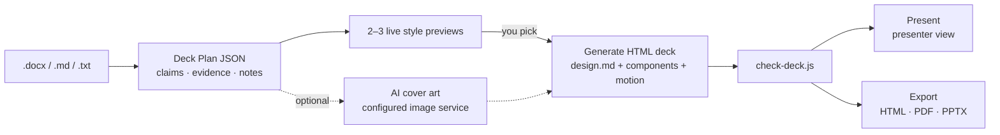

<div align="center">

# Agent-Native Slides

**An agent skill that teaches your coding agent to *design* presentations — not fill templates.**

Give it a `.docx` / `.md` / `.txt`. Get back an animated 1920×1080 HTML deck in one of **53 live styles**,
with speaker notes, a presenter view, and single-file HTML / PDF / PPTX export.

[](LICENSE)


**English** · [中文](README.zh-CN.md)


<sub>Every frame is a screenshot of a real <code>preview.html</code> in this repo. No mock-ups.</sub>

</div>

---

## Why "agent-native"?

Most slide skills hand the agent a pile of templates. This one hands it a **design system it can reason with**, plus a runtime contract strict enough that whatever it writes can be checked, presented and exported by scripts.

| | |
|---|---|
| 🧠 **Design knowledge, not templates** | Four layers the agent reads on demand: **Elements** (type scale, density, spacing) → **Components** (charts, formulas, code, ML diagrams) → **Styles** (53 design languages) → **Motion** (14 background atmospheres + entrance/emphasis/data motion). |
| 📐 **Assertion–evidence planning** | Before any pixel, the doc becomes a **Deck Plan JSON**: every slide gets a claim headline, its evidence type (`chart · diagram · image · formula · code`) and speaker notes. |
| 👀 **Show, don't tell** | The agent matches your *mood × occasion* against the style index and opens **2–3 real, animated previews** for you to pick from. You react to what you see instead of describing a vibe. |
| 🎨 **53 styles · 15 families** | From circuit-board dark tech to journal-grade academic, Swiss grids, glassmorphism, risograph and art-deco. Each style ships a `design.md` (OKLCH tokens, type pairing, layout rules) **and** a working 3-slide `preview.html`. |
| 📊 **Research-grade components** | ECharts charts, KaTeX formulas, highlighted code, and hand-drawn SVG diagrams for ML (architectures, attention, retrieval pipelines) — all themed by CSS tokens. |
| 🖼️ **AI imagery, optional** | Configure AIHubMix or an OpenAI Images API compatible service for cover and section art, then inline it into a single portable file. Data charts never go through an image model. |
| ✅ **One runtime contract** | Every deck exposes `__goToSlide(n)`, `?preview=N`, `?print=1`, fit-to-window scaling and a shared print stylesheet (`knowledge/RUNTIME.md`). `check-deck.js` validates it, so export and presenter tools just work. All 57 bundled decks pass. |
| 📤 **Real exports** | Single-file HTML (images and fonts inlined), 16:9 PDF (one slide per page), PPTX with speaker notes. |
| 🔓 **Free and open only** | Every dependency is open source with pinned versions; CJK and mono fonts (OFL) are bundled. Paid platforms are cited as visual reference only. |

## Install

**One command** (any agent supported by the [`skills`](https://www.npmjs.com/package/skills) CLI):

```bash
npx skills add https://github.com/hhuang999/agent-native-slides
```

**Or clone it into your agent's skills folder:**

```bash
# Claude Code
git clone https://github.com/hhuang999/agent-native-slides ~/.claude/skills/agent-native-slides
# Codex
git clone https://github.com/hhuang999/agent-native-slides ~/.codex/skills/agent-native-slides
```

**Other agents** (Cursor, Gemini CLI, OpenCode, …): point the agent at this repo or at `SKILL.md`. It is the entry point and loads the rest on demand.

The check / export scripts need Node.js 18+:

```bash
cd <skill-dir>/scripts && npm install
npx playwright install chromium   # optional — falls back to your local Chrome / Edge
```

## Use it

Just ask:

> "Turn `thesis.docx` into a 15-minute defense deck."
> "Make a 10-slide pitch deck from this outline, something dark and premium."
> "把这份周报做成 8 页的汇报 PPT，学术风。"

What the agent does:



1. **Read**: `.docx` is converted with mammoth; title, venue and length are extracted.
2. **Plan**: the Deck Plan JSON (`prompts/deck-plan-schema.md`) separates short on-slide `visible_text` from fuller speaker notes. The 100–200-word planning chunks are source material, not slide copy.
3. **Pick a style**: the agent queries `knowledge/style/index.json` by mood × occasion and shows you 2–3 live previews. It never skips this step.
4. **Images (optional)**: `imagegen.js` makes decorative art; charts stay in ECharts.
5. **Generate**: a single HTML deck following the chosen `design.md` and shared readability rules in `knowledge/element/elements.md`. Shorten copy, change layout, or split a slide before reducing type size.
6. **Review**: a Studio viewer shows thumbnails and notes.
7. **Present**: keyboard navigation, `data-step` reveals, presenter view.
8. **Export**: after fonts load, `check-deck` checks each slide for text overflow, clipping, and overlap in screen and print layouts. Then inline / PDF / PPTX; PDF and PPTX exports check their capture layouts too.

### Text fit and readability

Plan one claim and one visual per speaker slide. Keep explanations in speaker notes; for a reading deck, split long passages across slides. Design on the fixed 1920×1080 stage with readable body text (usually 28–36px for speaking, at least 24px for reading). Do not use viewport-sized typography inside the stage: the stage already scales to the window. Check the real rendered page after fonts load, including Chinese, English, and mixed-script text; word counts alone cannot predict line breaks. The geometry check reports visible text collisions and clipping, while final screenshot review remains necessary for charts, canvas labels, and overall density.

Run `node --test scripts/test/layout.test.js` for Chinese, English, and mixed-script cases, including deliberate overflow, clipping, and overlap and the PDF/PPTX export guards.

### Fonts across all styles

The 53 styles have explicit [display, body, auxiliary, and fallback choices](knowledge/style/font-policy.json). Each preview loads bundled Simplified Chinese faces from `knowledge/style/font-fallback.css` while retaining its selected Latin face; the font stacks also name an offline Latin backup. For a generated deck, copy the relevant local `@font-face` rules into the deck, set its `<html lang>` correctly, and inline assets for portable HTML. I02 preserves Japanese faces for Japanese decks and selects Simplified Chinese glyph forms for `lang="zh-CN"`.

Check both font states with `node scripts/check-deck.js deck.html --font-fallback`. This reruns text geometry in screen and print layouts with remote font requests blocked. The [font audit](docs/font-audit.md) lists every style and the measured HTML/PDF/PPTX results. Font loading and fallback behavior follows the [CSS Font Loading API](https://developer.mozilla.org/en-US/docs/Web/API/Document/fonts) and [Google Fonts CSS API](https://developers.google.com/fonts/docs/css2); content should remain available when font metrics or text spacing change, as described by [W3C](https://www.w3.org/WAI/WCAG22/Understanding/text-spacing).

## Style gallery


Each style below shows its three preview slides: a **title**, an **evidence** slide and a **data / detail** slide. They open directly in a browser: `knowledge/style/<id>/preview.html` (`←` `→` to navigate, `?preview=N` for one slide, `?print=1` for the print layout).

<!-- GALLERY:START -->
### A · Dark Tech (8)

**A01 · circuit-engineered** — dark — technical · engineering · precise — for conference-talk / thesis-defense — type Geist Mono + Instrument Sans — motion `circuit-trace` — [design.md](knowledge/style/A01/design.md) · [preview.html](knowledge/style/A01/preview.html)


**A02 · ultraviolet-immersive** — dark — immersive · creative · energetic — for keynote / product-launch — type Syne + DM Sans — motion `mesh-drift` — [design.md](knowledge/style/A02/design.md) · [preview.html](knowledge/style/A02/preview.html)


**A03 · deep-sapphire** — dark — professional · authoritative · serious — for investor-pitch / conference-talk — type Instrument Serif + DM Sans — motion `aurora-band` — [design.md](knowledge/style/A03/design.md) · [preview.html](knowledge/style/A03/preview.html)


**A04 · cosmic-void** — dark — futuristic · expansive · science — for keynote / conference-talk — type Outfit + JetBrains Mono — motion `starfield-parallax` — [design.md](knowledge/style/A04/design.md) · [preview.html](knowledge/style/A04/preview.html)


**A05 · neon-cyberpunk** — dark — edgy · gaming · hacker — for keynote / product-launch — type Rajdhani + Instrument Sans — motion `hologram-scan` — [design.md](knowledge/style/A05/design.md) · [preview.html](knowledge/style/A05/preview.html)


**A06 · deep-ocean** — dark — serene · organic · science — for conference-talk / keynote — type Fraunces + DM Sans — motion `wave-sine` — [design.md](knowledge/style/A06/design.md) · [preview.html](knowledge/style/A06/preview.html)


**A07 · holographic-iridescent** — dark — futuristic · creative · fashion — for keynote / product-launch — type Lexend Mega + Lexend — motion `hologram-scan` — [design.md](knowledge/style/A07/design.md) · [preview.html](knowledge/style/A07/preview.html)


**A08 · dark-vaporwave** — dark — retro · nostalgic · pop-culture — for keynote / product-launch — type Silkscreen + Josefin Sans — motion `shader-grain` — [design.md](knowledge/style/A08/design.md) · [preview.html](knowledge/style/A08/preview.html)


### B · Glassmorphism (4)

**B01 · dark-glassmorphism** — dark — modern · sleek · tech — for product-launch / investor-pitch — type Plus Jakarta Sans + Space Mono — motion `particle-float` — [design.md](knowledge/style/B01/design.md) · [preview.html](knowledge/style/B01/preview.html)


**B02 · light-glassmorphism** — light — airy · modern · clean — for product-launch / team-update — type Instrument Serif + DM Sans — motion `particle-float` — [design.md](knowledge/style/B02/design.md) · [preview.html](knowledge/style/B02/preview.html)


**B03 · aurora-glass** — dark — immersive · colorful · creative — for keynote / product-launch — type Syne + Instrument Sans — motion `aurora-band` — [design.md](knowledge/style/B03/design.md) · [preview.html](knowledge/style/B03/preview.html)


**B04 · warm-glass** — light — warm · elegant · premium — for investor-pitch / keynote — type Playfair Display SC + IBM Plex Sans — motion `gradient-breathe` — [design.md](knowledge/style/B04/design.md) · [preview.html](knowledge/style/B04/preview.html)


### C · Cinematic (4)

**C01 · film-noir** — dark — cinematic · dramatic · editorial — for keynote / product-launch — type Bebas Neue + IBM Plex Mono — motion `film-grain` — [design.md](knowledge/style/C01/design.md) · [preview.html](knowledge/style/C01/preview.html)


**C02 · dark-editorial-cinema** — dark — editorial · cinematic · creative — for keynote / product-launch — type Cormorant Garamond + Space Grotesk — motion `film-grain` — [design.md](knowledge/style/C02/design.md) · [preview.html](knowledge/style/C02/preview.html)


**C03 · light-editorial-magazine** — light — editorial · refined · literary — for seminar / conference-talk — type DM Serif Display + DM Sans — motion `light-sweep` — [design.md](knowledge/style/C03/design.md) · [preview.html](knowledge/style/C03/preview.html)


**C04 · cinematic-amber** — dark — warm · nostalgic · cinematic — for keynote / seminar — type Fraunces + Plus Jakarta Sans — motion `film-grain` — [design.md](knowledge/style/C04/design.md) · [preview.html](knowledge/style/C04/preview.html)


### D · Swiss / International (4)

**D01 · swiss-international** — light — minimal · rational · precise — for conference-talk / thesis-defense — type IBM Plex Sans Condensed + IBM Plex Sans — motion `grain-breathe` — [design.md](knowledge/style/D01/design.md) · [preview.html](knowledge/style/D01/preview.html)


**D02 · bauhaus-geometric** — light — geometric · artistic · bold — for seminar / keynote — type Archivo Black + Space Grotesk — motion `dot-pulse` — [design.md](knowledge/style/D02/design.md) · [preview.html](knowledge/style/D02/preview.html)


**D03 · brutalist-editorial** — light — bold · editorial · raw — for keynote / conference-talk — type Barlow Condensed + Barlow — motion `grain-breathe` — [design.md](knowledge/style/D03/design.md) · [preview.html](knowledge/style/D03/preview.html)


**D04 · dark-swiss** — dark — minimal · serious · technical — for conference-talk / thesis-defense — type IBM Plex Sans Condensed + IBM Plex Sans — motion `grain-breathe` — [design.md](knowledge/style/D04/design.md) · [preview.html](knowledge/style/D04/preview.html)


### E · Nordic Minimal (3)

**E01 · fog-grey-nordic** — light — minimal · calm · scholarly — for thesis-defense / seminar — type Hanken Grotesk + Hanken Grotesk — motion `gradient-breathe` — [design.md](knowledge/style/E01/design.md) · [preview.html](knowledge/style/E01/preview.html)


**E02 · pale-birch-nordic** — light — warm · natural · calm — for seminar / thesis-defense — type DM Serif Display + DM Sans — motion `light-sweep` — [design.md](knowledge/style/E02/design.md) · [preview.html](knowledge/style/E02/preview.html)


**E03 · glacier-blue-nordic** — light — cool · minimal · science — for thesis-defense / conference-talk — type Fraunces + Plus Jakarta Sans — motion `gradient-breathe` — [design.md](knowledge/style/E03/design.md) · [preview.html](knowledge/style/E03/preview.html)


### F · Atmospheric Gradient (3)

**F01 · aurora-borealis-dark** — dark — dramatic · colorful · creative — for keynote / conference-talk — type Bricolage Grotesque + Geist Mono — motion `aurora-band` — [design.md](knowledge/style/F01/design.md) · [preview.html](knowledge/style/F01/preview.html)


**F02 · aurora-dawn-light** — light — optimistic · creative · fresh — for product-launch / keynote — type Lora + Nunito — motion `mesh-drift` — [design.md](knowledge/style/F02/design.md) · [preview.html](knowledge/style/F02/preview.html)


**F03 · mesh-gradient-vivid** — light — vibrant · brand · creative — for product-launch / keynote — type Syne + Space Grotesk — motion `mesh-drift` — [design.md](knowledge/style/F03/design.md) · [preview.html](knowledge/style/F03/preview.html)


### G · Academic / Journal (4)

**G01 · light-journal-academic** — light — academic · scholarly · rigorous — for conference-talk / thesis-defense — type EB Garamond + Source Code Pro — motion `grain-breathe` — [design.md](knowledge/style/G01/design.md) · [preview.html](knowledge/style/G01/preview.html)


**G02 · dark-journal-academic** — dark — academic · focused · nocturnal — for conference-talk / thesis-defense — type Playfair Display + EB Garamond — motion `grain-breathe` — [design.md](knowledge/style/G02/design.md) · [preview.html](knowledge/style/G02/preview.html)


**G03 · neutral-academic-beige** — light — academic · bilingual · neutral — for thesis-defense / seminar — type Source Serif 4 + Source Sans 3 — motion `light-sweep` — [design.md](knowledge/style/G03/design.md) · [preview.html](knowledge/style/G03/preview.html)


**G04 · clean-academic-sans** — light — academic · engineering · technical — for thesis-defense / conference-talk — type DM Sans + DM Sans — motion `gradient-breathe` — [design.md](knowledge/style/G04/design.md) · [preview.html](knowledge/style/G04/preview.html)


### H · Corporate / Business (3)

**H01 · primer-clean** — light — corporate · professional · clear — for team-update / investor-pitch — type Inter + Inter — motion `gradient-breathe` — [design.md](knowledge/style/H01/design.md) · [preview.html](knowledge/style/H01/preview.html)


**H02 · trust-blue** — light — authoritative · financial · corporate — for investor-pitch / team-update — type Libre Baskerville + Libre Franklin — motion `light-sweep` — [design.md](knowledge/style/H02/design.md) · [preview.html](knowledge/style/H02/preview.html)


**H03 · executive-dark-bold** — dark — premium · executive · bold — for investor-pitch / keynote — type Syne + Space Grotesk — motion `grain-breathe` — [design.md](knowledge/style/H03/design.md) · [preview.html](knowledge/style/H03/preview.html)


### I · Texture / Organic (4)

**I01 · cream-paper-warm** — light — warm · scholarly · tactile — for seminar / thesis-defense — type Cormorant Garamond + Jost — motion `grain-breathe` — [design.md](knowledge/style/I01/design.md) · [preview.html](knowledge/style/I01/preview.html)


**I02 · wabi-sabi-japanese** — light — zen · minimalist · japanese — for seminar / keynote — type Shippori Mincho + Noto Sans JP — motion `grain-breathe` — [design.md](knowledge/style/I02/design.md) · [preview.html](knowledge/style/I02/preview.html)


**I03 · warm-film-grain** — dark — nostalgic · cinematic · warm — for keynote / seminar — type Instrument Serif + Space Grotesk — motion `film-grain` — [design.md](knowledge/style/I03/design.md) · [preview.html](knowledge/style/I03/preview.html)


**I04 · soft-bento** — light — modern · playful · structured — for product-launch / team-update — type Nunito + Nunito — motion `gradient-breathe` — [design.md](knowledge/style/I04/design.md) · [preview.html](knowledge/style/I04/preview.html)


### J · Technical / Engineering (3)

**J01 · terminal-monochrome** — dark — hacker · engineering · retro — for conference-talk / workshop — type JetBrains Mono + JetBrains Mono — motion `circuit-trace` — [design.md](knowledge/style/J01/design.md) · [preview.html](knowledge/style/J01/preview.html)


**J02 · data-dashboard** — dark — data · analytical · technical — for conference-talk / group-meeting — type IBM Plex Sans + IBM Plex Mono — motion `particle-float` — [design.md](knowledge/style/J02/design.md) · [preview.html](knowledge/style/J02/preview.html)


**J03 · light-engineering** — light — precise · technical · engineering — for conference-talk / thesis-defense — type IBM Plex Serif + IBM Plex Sans — motion `light-sweep` — [design.md](knowledge/style/J03/design.md) · [preview.html](knowledge/style/J03/preview.html)


### K · Premium / Luxury (3)

**K01 · monochrome-luxury** — light — luxury · fashion · minimal — for keynote / investor-pitch — type Cormorant Garamond + Jost — motion `light-sweep` — [design.md](knowledge/style/K01/design.md) · [preview.html](knowledge/style/K01/preview.html)


**K02 · gold-dark-premium** — dark — luxury · premium · exclusive — for keynote / investor-pitch — type Playfair Display + Lato — motion `gradient-breathe` — [design.md](knowledge/style/K02/design.md) · [preview.html](knowledge/style/K02/preview.html)


**K03 · dusty-rose-editorial** — light — fashion · editorial · feminine — for keynote / product-launch — type Libre Baskerville + Raleway — motion `gradient-breathe` — [design.md](knowledge/style/K03/design.md) · [preview.html](knowledge/style/K03/preview.html)


### L · AI / Tech Immersive (3)

**L01 · deep-ai-dark** — dark — ai · futuristic · technical — for conference-talk / keynote — type Syne + Geist Mono — motion `mesh-drift` — [design.md](knowledge/style/L01/design.md) · [preview.html](knowledge/style/L01/preview.html)


**L02 · purple-ai-immersive** — dark — ai · creative · mysterious — for keynote / product-launch — type Bricolage Grotesque + Geist Mono — motion `mesh-drift` — [design.md](knowledge/style/L02/design.md) · [preview.html](knowledge/style/L02/preview.html)


**L03 · teal-ai-light** — light — ai · fresh · modern — for product-launch / conference-talk — type Plus Jakarta Sans + Plus Jakarta Sans — motion `gradient-breathe` — [design.md](knowledge/style/L03/design.md) · [preview.html](knowledge/style/L03/preview.html)


### M · Illustration / Artistic (3)

**M01 · watercolor-wash** — light — artistic · organic · creative — for seminar / keynote — type Playfair Display + Lato — motion `gradient-breathe` — [design.md](knowledge/style/M01/design.md) · [preview.html](knowledge/style/M01/preview.html)


**M02 · ink-illustration** — light — traditional · scholarly · east-asian — for seminar / thesis-defense — type Spectral + Jost — motion `grain-breathe` — [design.md](knowledge/style/M02/design.md) · [preview.html](knowledge/style/M02/preview.html)


**M03 · risograph-print** — light — retro · print · indie — for keynote / workshop — type Space Grotesk + Space Grotesk — motion `dot-pulse` — [design.md](knowledge/style/M03/design.md) · [preview.html](knowledge/style/M03/preview.html)


### N · Retro / Historical (2)

**N01 · art-deco-gold** — dark — art-deco · luxurious · geometric — for keynote / investor-pitch — type Cinzel + Cormorant Garamond — motion `gradient-breathe` — [design.md](knowledge/style/N01/design.md) · [preview.html](knowledge/style/N01/preview.html)


**N02 · retro-modern-50s** — light — retro · playful · optimistic — for keynote / product-launch — type Bebas Neue + Nunito — motion `light-sweep` — [design.md](knowledge/style/N02/design.md) · [preview.html](knowledge/style/N02/preview.html)


### O · Nature / Earth (2)

**O01 · organic-moss** — dark — organic · nature · environmental — for keynote / seminar — type Lora + Nunito — motion `liquid-blob` — [design.md](knowledge/style/O01/design.md) · [preview.html](knowledge/style/O01/preview.html)


**O02 · sand-dune** — light — warm · expansive · natural — for keynote / seminar — type Fraunces + Plus Jakarta Sans — motion `gradient-breathe` — [design.md](knowledge/style/O02/design.md) · [preview.html](knowledge/style/O02/preview.html)


<!-- GALLERY:END -->

## Motion


14 background atmospheres (`circuit-trace`, `aurora-band`, `starfield-parallax`, `mesh-drift`, `hologram-scan`, `wave-sine`, `shader-grain`, `particle-float`, `gradient-breathe`, `film-grain`, `light-sweep`, `grain-breathe`, `dot-pulse`, `liquid-blob`), plus entrance, emphasis and data-motion snippets in `knowledge/motion/motion.md`. Everything respects `prefers-reduced-motion` and is switched off for print.

## Components


| Demo | What's inside |
|---|---|
| `knowledge/component/charts-demo.html` | ECharts line / bar / heatmap, colored from the deck's CSS tokens |
| `knowledge/component/code-math-demo.html` | highlight.js code, KaTeX equations, algorithm and derivation side by side |
| `knowledge/component/ml-visuals-demo.html` | Hand-drawn SVG: transformer blocks, attention routing, a retrieval-augmented generation flow — no image files |
| `knowledge/component/presentation-primitives-demo.html` | KPI rows, comparisons, timelines, quotes, data tables |

## AI images (optional, bring your own key)


Copy `.env.example` to `.env` in the **project root** (PowerShell: `Copy-Item .env.example .env`; Bash: `cp .env.example .env`). Put your key in `.env`; this file is Git ignored. Image generation is optional: planning, rendering, charts, and exports do not require an image key. Shell environment variables override `.env` values.

| Setting | AIHubMix default | What it does |
|---|---|---|
| `IMAGE_PROVIDER` | `aihubmix` if omitted | `aihubmix` or `openai-compatible` |
| `IMAGE_API_URL` | `https://aihubmix.com/ai/v1/images/generations` | Full POST endpoint; required for `openai-compatible` |
| `IMAGE_API_KEY` | None | Bearer token; required only when running `imagegen.js`. For AIHubMix, the existing `AIHUBMIX_API_KEY` environment variable also works. |
| `IMAGE_MODEL` | `gpt-image-2.5-sunburst` | Model ID; required for `openai-compatible` unless `--model` is passed. `--model` takes precedence. |

For the default AIHubMix route, leave `IMAGE_PROVIDER`, `IMAGE_API_URL`, and `IMAGE_MODEL` as shown or commented in `.env.example`, and set `IMAGE_API_KEY` (or continue using `AIHUBMIX_API_KEY` in the shell). The native endpoint reads the model schema to choose `size` or `aspect_ratio`, polls async tasks, falls back to AIHubMix's synchronous endpoint when async tasks are disabled, and retries with `gpt-image-2` if the selected model fails. `--no-fallback` disables that model retry.

To switch to a service that implements the **synchronous OpenAI Images API** `POST /images/generations` contract, set these values in `.env`:

```dotenv
IMAGE_PROVIDER=openai-compatible
IMAGE_API_URL=https://your-service.example/v1/images/generations
IMAGE_API_KEY=replace-with-your-own-key
IMAGE_MODEL=your-image-model
```

This adapter sends a Bearer token and JSON `{model,prompt,n:1,size}` (plus `quality` only when requested). It accepts `data[0].b64_json` or `data[0].url`. It does not perform schema lookup, async polling, model fallback, or adapt native Gemini, Flux, or other provider-specific APIs. A service with a different request or response format needs its own adapter; changing the URL alone will not make it compatible.

```bash
node scripts/imagegen.js "soft aurora over dark sea, empty left third, no text" deck/assets/cover.jpg --size 2048x1152
# reference it as assets/cover.jpg in the deck, then make one portable file:
node scripts/inline-assets.js deck/deck.html
```

Run `node --test scripts/test/imagegen.test.js` to verify the default AIHubMix settings and the native and custom URL request flows against local mock servers. The tests make no billable image API calls and check that server error text cannot leak the key. Secrets are never inserted into deck files or printed by `imagegen.js`.

<details>
<summary><b>Model comparison</b> — same prompt, 1536×1024, tested 2026-09-30</summary>


| Model | Time | Notes |
|---|---|---|
| `gpt-image-2.5-sunburst` | ~35 s | Best composition and detail — **default** |
| `gpt-image-2.5-flare` | ~25 s | Similar look, faster; may add objects not asked for |
| `gpt-image-2` | ~20 s | Reliable — **automatic fallback** |
| `flux-2-pro` | ~11 s | Fastest; stylized, can render stray numbers |
| `flux-2-flex` | ~15 s | Soft, painterly |
| `gemini-3.1-flash-image` | ~11 s | Aspect ratio only (the script maps `--size`) |
| `qwen-image-2.0-pro` | ~25 s | Hazy, low contrast; PNG only |

Async-only models (`flux-2-*`) need async tasks enabled in the AIHubMix console. `imagen-4.0` and `doubao-seedream-5.0-pro` are listed but returned `model_not_found` on the test account.

</details>

## Present

<table>
<tr>
<td width="50%"></td>
<td width="50%"></td>
</tr>
<tr>
<td><b>Presenter view</b>: current and next slide, speaker notes, timer.</td>
<td><b>Studio</b>: thumbnails, Deck Plan notes, fullscreen, jump to the presenter view.</td>
</tr>
</table>

Both previews load the deck itself with `?preview=N`, so they use the same CSS, fonts and theme as the audience view. The Studio is a viewer; to change a deck, edit the HTML and press `R`.

```
Deck        ← → Space PgUp PgDn   navigate        Home / End   first / last slide
            ?preview=N            one slide, no chrome
            ?print=1              print layout
Studio      F fullscreen   P presenter   R reload   ? help
Presenter   ← → Space PgUp PgDn   navigate   Home / End   B blackout
```

Serve the skill root over HTTP for the Studio (`npx serve .`), then open `studio/editor.html?deck=/path/to/deck.html`.

## Export

| Command | Output |
|---|---|
| `node scripts/check-deck.js deck.html [--json report.json] [--font-fallback]` | Validates runtime and text geometry in screen/print; `--font-fallback` also checks both layouts with remote fonts blocked |
| `node scripts/inline-assets.js deck.html [out.html]` | **Single-file HTML**: local images and fonts become data URIs, so the deck survives being moved or emailed |
| `node scripts/export-pdf.js deck.html [out.pdf]` | **PDF**, 16:9, one 1920×1080 page per slide; checks print text layout before writing |
| `node scripts/export-pptx.js deck.html [plan.json] [out.pptx]` | **PPTX**: one full-bleed image per slide plus speaker notes (slide text is not editable); checks each capture before writing |
| `node scripts/imagegen.js "<prompt>" out.jpg` | AI decorative image via the configured service |

## Repository layout

```
SKILL.md              entry point: the 8-step workflow the agent follows
knowledge/
  RUNTIME.md          deck runtime contract: stage, slide switching, ?preview, print
  element/            typography, density, spacing
  component/          charts · code + math · ML visuals · primitives (+ live demos)
  style/              53 × { design.md, preview.html } + index.json
  motion/             background atmospheres, entrance / emphasis / data motion
prompts/              Deck Plan JSON schema
scripts/              check-deck · inline-assets · export-pdf · export-pptx · imagegen
studio/               editor.html (viewer) · presenter.html
assets/fonts/         bundled CJK + mono fonts (SIL OFL 1.1)
docs/readme/          README artwork only — not needed at runtime
SOURCES.md            every external resource with version and license
```

## Philosophy

- **Teach design, not templates.** A style is a set of reasons (tokens, hierarchy, rhythm) the agent can apply to content it has never seen.
- **Claim first.** Every slide title is a full-sentence assertion; the body is its evidence.
- **Let people react.** Real, animated previews beat adjectives.
- **Contracts over conventions.** One small runtime API makes every deck checkable, presentable and exportable.
- **Single files age well.** No build step, pinned CDN versions, and an inliner for fully portable decks.

## License

[MIT](LICENSE) for this repository's code and docs. Bundled fonts are under the SIL OFL 1.1; CDN libraries keep their own licenses (see [SOURCES.md](SOURCES.md)).
Paid platforms (Gamma, Pitch, Magic UI Pro, Aceternity Pro, …) are cited as visual reference only; no code or assets are taken from them.
