<div align="center">

# Agent-Native Slides

**一个让 AI 编程助手学会"设计"演示文稿的 Agent Skill，不是模板包。**

输入 `.docx` / `.md` / `.txt`，产出 1920×1080 的动态 HTML 幻灯片：**53 种可实时预览的风格**、演讲者备注、演讲者视图，
并可在交付的单文件 HTML 内编辑、保存，导出 PDF、元素级可编辑 PPTX 或明确标注的整页图片版 PPTX。

[](LICENSE)


[English](README.md) · **中文**

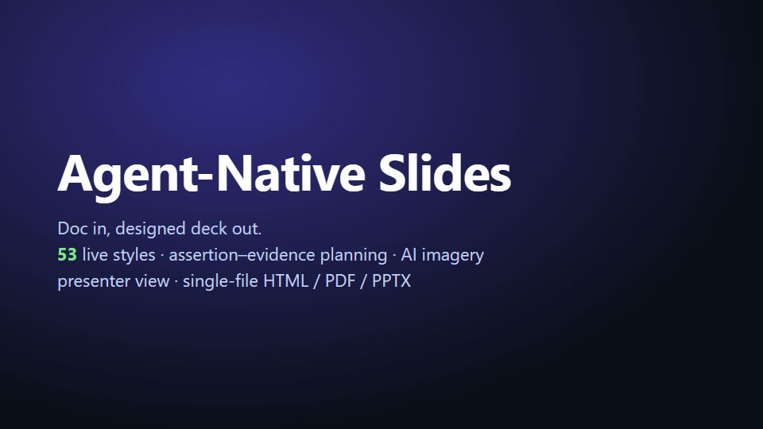

<sub>每一帧都是本仓库中真实 <code>preview.html</code> 的截图，没有任何效果图。</sub>

</div>

---

## 为什么叫 "Agent-Native"？

大多数幻灯片 Skill 给 Agent 一堆模板；这个 Skill 给它的是一套**能推理的设计体系**，外加一份足够严格的运行时合同：Agent 写出的任何 deck 都能被脚本校验、演示和导出。

| | |
|---|---|
| 🧠 **设计知识，而不是模板** | 四层知识按需加载：**元素**（字号层级、信息密度、留白）→ **组件**（图表、公式、代码、ML 示意图）→ **风格**（53 套设计语言）→ **动效**（14 种背景氛围 + 入场 / 强调 / 数据动效）。 |
| 📐 **论点–证据式规划** | 动手画之前，先把文档变成 **Deck Plan JSON**：每页一个完整句子的论点标题、证据类型（`chart · diagram · image · formula · code`）和演讲者备注。 |
| 👀 **看了再选** | Agent 按"情绪 × 场合"检索风格索引，打开 **2–3 个真实的动态预览**给你挑。你只需要对看到的东西做反应，不用描述"感觉"。 |
| 🎨 **53 种风格 · 15 个家族** | 从电路板暗色科技到期刊级学术风，瑞士网格、玻璃拟态、孔版印刷、装饰艺术……每种风格都有 `design.md`（OKLCH 色彩 token、字体搭配、版式规则）**和**一个可运行的 3 页 `preview.html`。 |
| 📊 **科研级组件** | ECharts 图表、KaTeX 公式、代码高亮、手绘 SVG 的 ML 示意图（模型架构、注意力、检索流程），全部由 CSS token 统一着色。 |
| 🖼️ **AI 配图（可选）** | 配置 AIHubMix 或兼容 OpenAI Images API 的服务，生成封面和章节配图，再内联成单个可移动的文件。数据图表永远不走生图模型。 |
| ✅ **统一的运行时合同** | 每个 deck 都提供 `__goToSlide(n)`、`?preview=N`、`?print=1`、自适应窗口缩放和统一的打印样式（`knowledge/RUNTIME.md`）。`check-deck.js` 负责校验，导出和演讲工具因此开箱即用。仓库自带的 57 个 deck 全部通过。 |
| 📤 **真正可用的导出** | 内嵌工作台的单文件 HTML、16:9 PDF、带备注的元素级可编辑 PPTX，以及独立的整页图片版 PPTX。 |
| 🔓 **只用免费开源资源** | 所有依赖开源并锁定版本；内置中文和等宽字体（OFL）。付费平台仅作视觉参考。 |

## 安装

**一条命令**（适用于 [`skills`](https://www.npmjs.com/package/skills) CLI 支持的所有 Agent）：

```bash
npx skills add https://github.com/hhuang999/agent-native-slides
```

**或者克隆到 Agent 的 skills 目录：**

```bash
# Claude Code
git clone https://github.com/hhuang999/agent-native-slides ~/.claude/skills/agent-native-slides
# Codex
git clone https://github.com/hhuang999/agent-native-slides ~/.codex/skills/agent-native-slides
```

**其他 Agent**（Cursor、Gemini CLI、OpenCode……）：把本仓库或 `SKILL.md` 发给 Agent 即可。`SKILL.md` 是入口，其余文件按需加载。

生成、校验和导出脚本需要 Node.js 18+：

```bash
cd <skill 目录>/scripts && npm install
npx playwright install chromium   # 可选；没装时会自动使用本机的 Chrome / Edge
```

## 怎么用

直接说：

> "把 `thesis.docx` 做成 15 分钟的答辩 PPT。"
> "按这个大纲做 10 页融资路演，要暗色、高级感。"
> "把这份周报做成 8 页的汇报 PPT，学术风。"

Agent 会这样做：

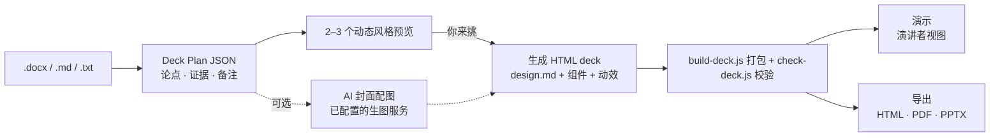

1. **读入**：`.docx` 用 mammoth 转成 Markdown，提取标题、场合和篇幅。
2. **规划**：Deck Plan JSON（`prompts/deck-plan-schema.md`）把简短的上屏 `visible_text` 与详细演讲备注分开。100–200 词是输入材料的规划块，不是每页可见文字额度。
3. **选风格**：按情绪 × 场合检索 `knowledge/style/index.json`，展示 2–3 个动态预览，这一步从不跳过。
4. **配图（可选）**：`imagegen.js` 生成装饰性配图；图表始终用 ECharts。
5. **生成**：按所选风格的 `design.md` 创作版本化对象文档和主题 CSS，运行 `node scripts/build-deck.js document.json deck.html` 打包成单文件 HTML。未知内容对象会明确报错。
6. **审阅和编辑**：打开交付的 HTML，点击“Edit deck”。页面、对象、图层、备注、总览、撤销重做、保存和草稿恢复都在文件内。
7. **演示**：键盘翻页，`O` 页面总览，`P` 演讲者视图，`B` 黑屏。
8. **导出**：运行 `check-deck.js`，再从已保存 HTML 导出 PDF 或默认可编辑 PPTX。未保存编辑可交给本地助手直接导出；整页图片 PPTX 使用独立的 `--image` 模式。

### 可编辑工作台与导出

```bash
node scripts/build-deck.js document.json deck.html
node scripts/check-deck.js deck.html --font-fallback
node scripts/export-pptx.js deck.html                 # 元素级可编辑
node scripts/export-pptx.js deck.html --image         # 整页图片版
node scripts/export-pdf.js deck.html
node scripts/export-helper.js                        # 工作台未保存快照导出
node scripts/extract-document.js saved.html current.json  # 以用户保存版本继续 AI 修改
```

`build-deck.js` 会将运行时、工作台和本地资源打进单文件 HTML。内嵌 `#ans-document` 是唯一保存权威；DOM 和 `__deckPlan` 由它派生。直接写回磁盘需要浏览器提供 File System Access API 并由用户授权；其他浏览器可下载仍可编辑的 HTML 副本。工作台会保存浏览器草稿、覆盖前备份并检查关联文件的磁盘变化。本地助手从工作台接收未保存快照，记录用于 PDF/PPTX 导出的 SHA-256。默认 PPTX 保留文字、形状、连线、图片、表格、关系图与支持的图表为独立对象，逐对象转换限制见[能力矩阵](docs/editable-workbench.md)。

原有 53 种风格仍决定页面设计。HHB-HTML-PPT 对应编辑、文件保存与原生导出体验；lewislulu/html-ppt-skill 对应主题、页面总览、动效和演讲者体验。独立的 `studio/editor.html` 仍可查看旧 HTML；旧文稿不自动转换，可用 `--image` 导出 PPTX。

### 文字容量与可读性

演讲型页面保留一个主张和一项视觉证据，把长解释放入演讲备注；阅读型页面把长段落拆到续页。固定 1920×1080 舞台上的演讲正文通常用 28–36px，阅读正文至少 24px。舞台本身已按窗口缩放，不要再用 `vw` 字号造成双重缩小。字体加载后以实际渲染结果为准，尤其要检查中文、英文和中英混排的换行；字数预算不能代替版面检查。几何校验能发现可见文字的裁切与相撞，但图表画布文字和整体信息密度仍需人工看截图。

运行 `node --test scripts/test/layout.test.js` 可验证中文、英文和中英混排样例，以及故意制造的越界、裁切、重叠和 PDF/PPTX 导出拦截。

### 全风格字体适配

53 种风格的[标题、正文、辅助文字及回退字体配置](knowledge/style/font-policy.json)已逐一记录。每个预览页用 `knowledge/style/font-fallback.css` 加载项目自带的简体中文字体，同时保留原定拉丁字体，并指定离线英文字体备选。生成独立 deck 时应把所需的本地 `@font-face` 规则写入页面、设置正确的 `<html lang>`，再内联字体资源。I02 在日文页面保留日文字体，在 `lang="zh-CN"` 时优先使用简体中文字形。

运行 `node scripts/check-deck.js deck.html --font-fallback` 会阻断外部字体请求，再次检查屏幕和打印版面的文字几何。[字体审查记录](docs/font-audit.md)列出每种风格及 HTML/PDF/PPTX 实测结果。加载与回退依据 [CSS Font Loading API](https://developer.mozilla.org/en-US/docs/Web/API/Document/fonts)、[Google Fonts CSS API](https://developers.google.com/fonts/docs/css2) 和 [W3C 文字间距说明](https://www.w3.org/WAI/WCAG22/Understanding/text-spacing)。

## 风格一览

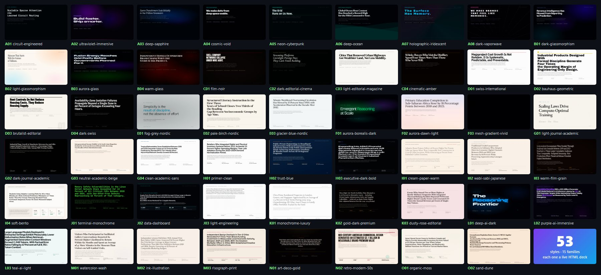

下面每种风格展示预览中的三页：**封面**、**证据页**、**数据 / 细节页**。它们都能直接用浏览器打开：`knowledge/style/<id>/preview.html`（`←` `→` 翻页，`?preview=N` 只显示第 N 页，`?print=1` 查看打印版式）。

<!-- GALLERY:START -->
### A · Dark Tech (8)

**A01 · circuit-engineered** — dark — technical · engineering · precise — for conference-talk / thesis-defense — type Geist Mono + Instrument Sans — motion `circuit-trace` — [design.md](knowledge/style/A01/design.md) · [preview.html](knowledge/style/A01/preview.html)

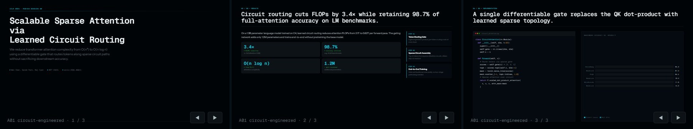

**A02 · ultraviolet-immersive** — dark — immersive · creative · energetic — for keynote / product-launch — type Syne + DM Sans — motion `mesh-drift` — [design.md](knowledge/style/A02/design.md) · [preview.html](knowledge/style/A02/preview.html)

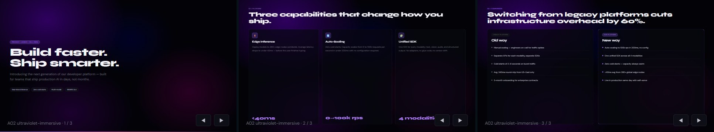

**A03 · deep-sapphire** — dark — professional · authoritative · serious — for investor-pitch / conference-talk — type Instrument Serif + DM Sans — motion `aurora-band` — [design.md](knowledge/style/A03/design.md) · [preview.html](knowledge/style/A03/preview.html)

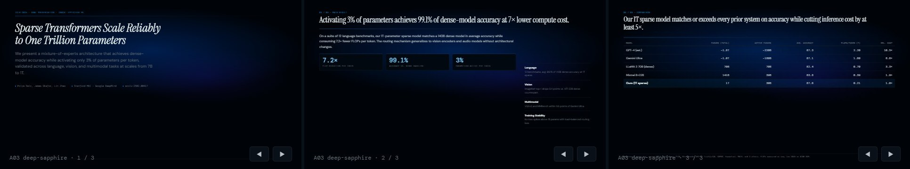

**A04 · cosmic-void** — dark — futuristic · expansive · science — for keynote / conference-talk — type Outfit + JetBrains Mono — motion `starfield-parallax` — [design.md](knowledge/style/A04/design.md) · [preview.html](knowledge/style/A04/preview.html)

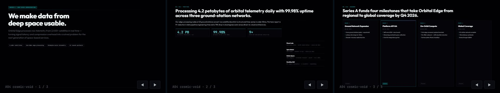

**A05 · neon-cyberpunk** — dark — edgy · gaming · hacker — for keynote / product-launch — type Rajdhani + Instrument Sans — motion `hologram-scan` — [design.md](knowledge/style/A05/design.md) · [preview.html](knowledge/style/A05/preview.html)

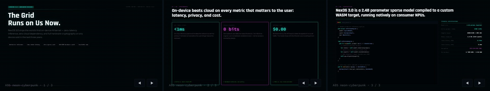

**A06 · deep-ocean** — dark — serene · organic · science — for conference-talk / keynote — type Fraunces + DM Sans — motion `wave-sine` — [design.md](knowledge/style/A06/design.md) · [preview.html](knowledge/style/A06/preview.html)

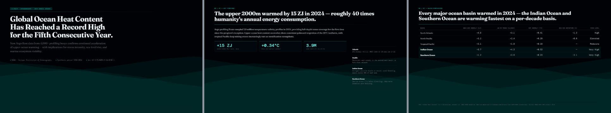

**A07 · holographic-iridescent** — dark — futuristic · creative · fashion — for keynote / product-launch — type Lexend Mega + Lexend — motion `hologram-scan` — [design.md](knowledge/style/A07/design.md) · [preview.html](knowledge/style/A07/preview.html)

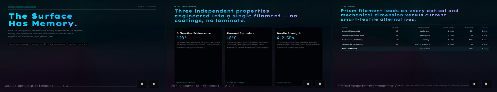

**A08 · dark-vaporwave** — dark — retro · nostalgic · pop-culture — for keynote / product-launch — type Silkscreen + Josefin Sans — motion `shader-grain` — [design.md](knowledge/style/A08/design.md) · [preview.html](knowledge/style/A08/preview.html)

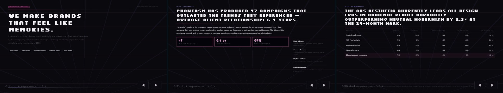

### B · Glassmorphism (4)

**B01 · dark-glassmorphism** — dark — modern · sleek · tech — for product-launch / investor-pitch — type Plus Jakarta Sans + Space Mono — motion `particle-float` — [design.md](knowledge/style/B01/design.md) · [preview.html](knowledge/style/B01/preview.html)

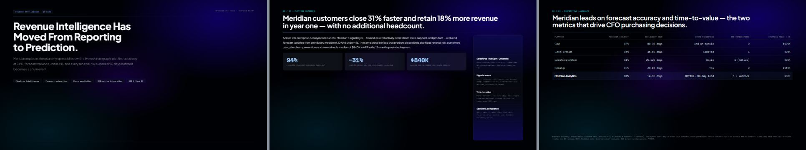

**B02 · light-glassmorphism** — light — airy · modern · clean — for product-launch / team-update — type Instrument Serif + DM Sans — motion `particle-float` — [design.md](knowledge/style/B02/design.md) · [preview.html](knowledge/style/B02/preview.html)

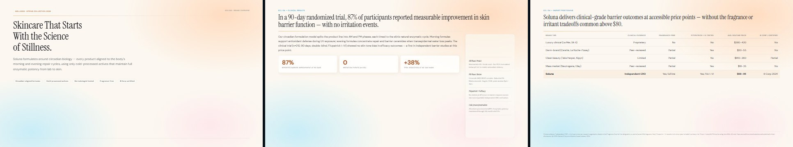

**B03 · aurora-glass** — dark — immersive · colorful · creative — for keynote / product-launch — type Syne + Instrument Sans — motion `aurora-band` — [design.md](knowledge/style/B03/design.md) · [preview.html](knowledge/style/B03/preview.html)

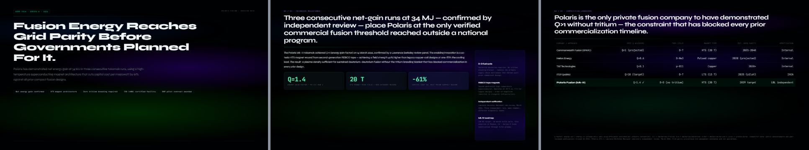

**B04 · warm-glass** — light — warm · elegant · premium — for investor-pitch / keynote — type Playfair Display SC + IBM Plex Sans — motion `gradient-breathe` — [design.md](knowledge/style/B04/design.md) · [preview.html](knowledge/style/B04/preview.html)

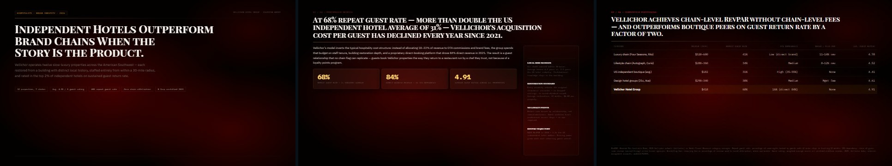

### C · Cinematic (4)

**C01 · film-noir** — dark — cinematic · dramatic · editorial — for keynote / product-launch — type Bebas Neue + IBM Plex Mono — motion `film-grain` — [design.md](knowledge/style/C01/design.md) · [preview.html](knowledge/style/C01/preview.html)

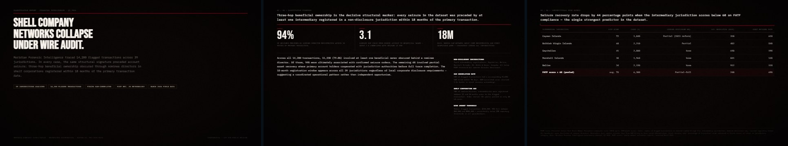

**C02 · dark-editorial-cinema** — dark — editorial · cinematic · creative — for keynote / product-launch — type Cormorant Garamond + Space Grotesk — motion `film-grain` — [design.md](knowledge/style/C02/design.md) · [preview.html](knowledge/style/C02/preview.html)

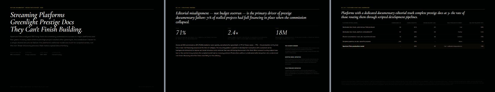

**C03 · light-editorial-magazine** — light — editorial · refined · literary — for seminar / conference-talk — type DM Serif Display + DM Sans — motion `light-sweep` — [design.md](knowledge/style/C03/design.md) · [preview.html](knowledge/style/C03/preview.html)

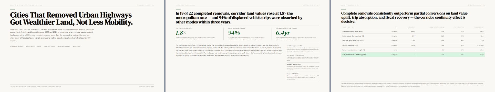

**C04 · cinematic-amber** — dark — warm · nostalgic · cinematic — for keynote / seminar — type Fraunces + Plus Jakarta Sans — motion `film-grain` — [design.md](knowledge/style/C04/design.md) · [preview.html](knowledge/style/C04/preview.html)

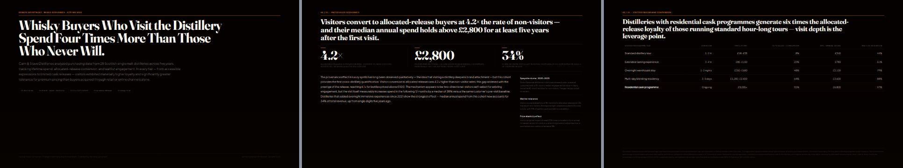

### D · Swiss / International (4)

**D01 · swiss-international** — light — minimal · rational · precise — for conference-talk / thesis-defense — type IBM Plex Sans Condensed + IBM Plex Sans — motion `grain-breathe` — [design.md](knowledge/style/D01/design.md) · [preview.html](knowledge/style/D01/preview.html)

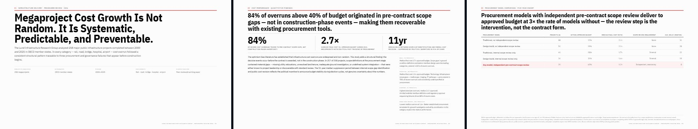

**D02 · bauhaus-geometric** — light — geometric · artistic · bold — for seminar / keynote — type Archivo Black + Space Grotesk — motion `dot-pulse` — [design.md](knowledge/style/D02/design.md) · [preview.html](knowledge/style/D02/preview.html)

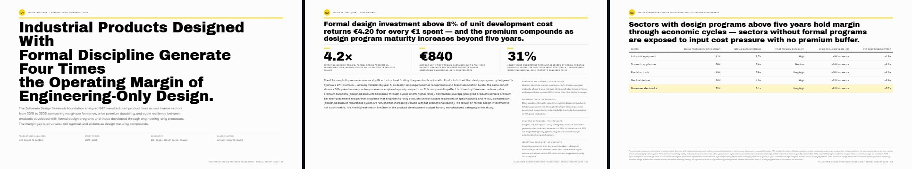

**D03 · brutalist-editorial** — light — bold · editorial · raw — for keynote / conference-talk — type Barlow Condensed + Barlow — motion `grain-breathe` — [design.md](knowledge/style/D03/design.md) · [preview.html](knowledge/style/D03/preview.html)

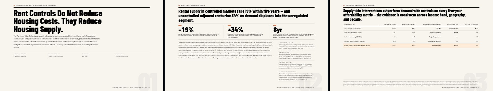

**D04 · dark-swiss** — dark — minimal · serious · technical — for conference-talk / thesis-defense — type IBM Plex Sans Condensed + IBM Plex Sans — motion `grain-breathe` — [design.md](knowledge/style/D04/design.md) · [preview.html](knowledge/style/D04/preview.html)

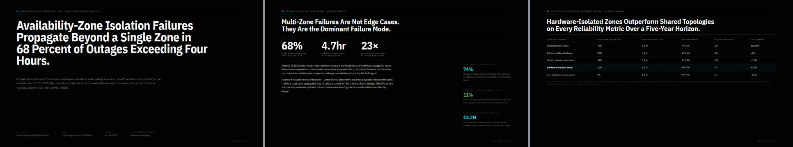

### E · Nordic Minimal (3)

**E01 · fog-grey-nordic** — light — minimal · calm · scholarly — for thesis-defense / seminar — type Hanken Grotesk + Hanken Grotesk — motion `gradient-breathe` — [design.md](knowledge/style/E01/design.md) · [preview.html](knowledge/style/E01/preview.html)

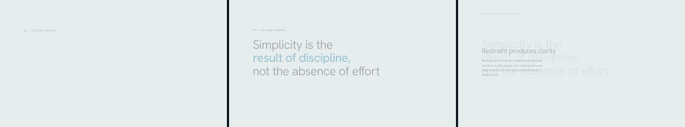

**E02 · pale-birch-nordic** — light — warm · natural · calm — for seminar / thesis-defense — type DM Serif Display + DM Sans — motion `light-sweep` — [design.md](knowledge/style/E02/design.md) · [preview.html](knowledge/style/E02/preview.html)

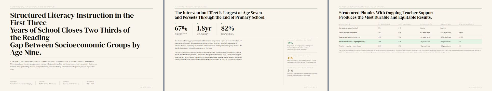

**E03 · glacier-blue-nordic** — light — cool · minimal · science — for thesis-defense / conference-talk — type Fraunces + Plus Jakarta Sans — motion `gradient-breathe` — [design.md](knowledge/style/E03/design.md) · [preview.html](knowledge/style/E03/preview.html)

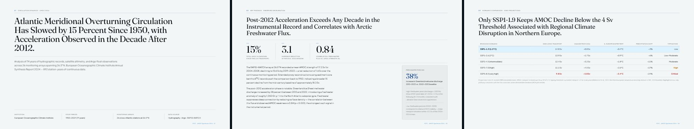

### F · Atmospheric Gradient (3)

**F01 · aurora-borealis-dark** — dark — dramatic · colorful · creative — for keynote / conference-talk — type Bricolage Grotesque + Geist Mono — motion `aurora-band` — [design.md](knowledge/style/F01/design.md) · [preview.html](knowledge/style/F01/preview.html)

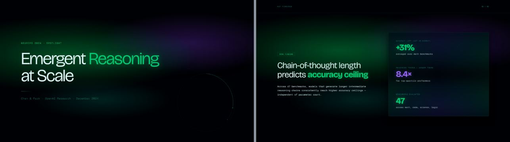

**F02 · aurora-dawn-light** — light — optimistic · creative · fresh — for product-launch / keynote — type Lora + Nunito — motion `mesh-drift` — [design.md](knowledge/style/F02/design.md) · [preview.html](knowledge/style/F02/preview.html)

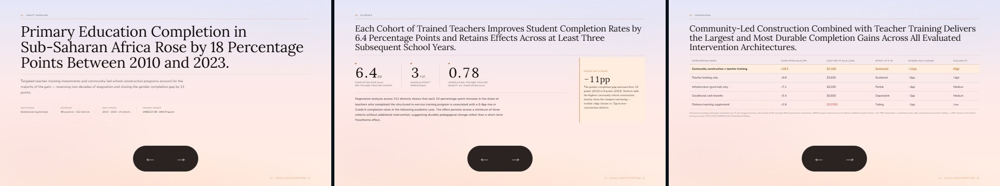

**F03 · mesh-gradient-vivid** — light — vibrant · brand · creative — for product-launch / keynote — type Syne + Space Grotesk — motion `mesh-drift` — [design.md](knowledge/style/F03/design.md) · [preview.html](knowledge/style/F03/preview.html)


### G · Academic / Journal (4)

**G01 · light-journal-academic** — light — academic · scholarly · rigorous — for conference-talk / thesis-defense — type EB Garamond + Source Code Pro — motion `grain-breathe` — [design.md](knowledge/style/G01/design.md) · [preview.html](knowledge/style/G01/preview.html)

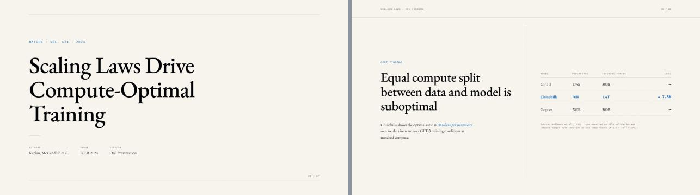

**G02 · dark-journal-academic** — dark — academic · focused · nocturnal — for conference-talk / thesis-defense — type Playfair Display + EB Garamond — motion `grain-breathe` — [design.md](knowledge/style/G02/design.md) · [preview.html](knowledge/style/G02/preview.html)

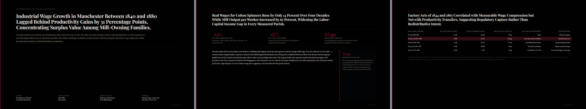

**G03 · neutral-academic-beige** — light — academic · bilingual · neutral — for thesis-defense / seminar — type Source Serif 4 + Source Sans 3 — motion `light-sweep` — [design.md](knowledge/style/G03/design.md) · [preview.html](knowledge/style/G03/preview.html)

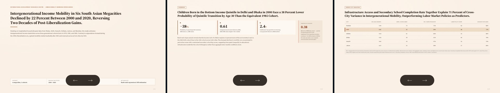

**G04 · clean-academic-sans** — light — academic · engineering · technical — for thesis-defense / conference-talk — type DM Sans + DM Sans — motion `gradient-breathe` — [design.md](knowledge/style/G04/design.md) · [preview.html](knowledge/style/G04/preview.html)

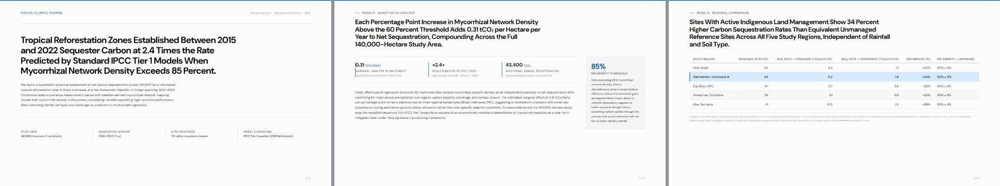

### H · Corporate / Business (3)

**H01 · primer-clean** — light — corporate · professional · clear — for team-update / investor-pitch — type Inter + Inter — motion `gradient-breathe` — [design.md](knowledge/style/H01/design.md) · [preview.html](knowledge/style/H01/preview.html)

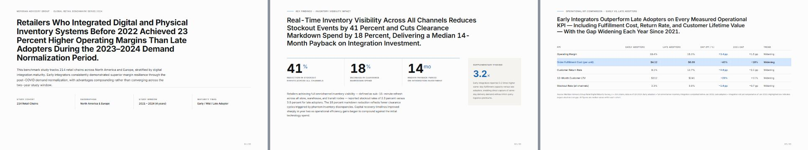

**H02 · trust-blue** — light — authoritative · financial · corporate — for investor-pitch / team-update — type Libre Baskerville + Libre Franklin — motion `light-sweep` — [design.md](knowledge/style/H02/design.md) · [preview.html](knowledge/style/H02/preview.html)

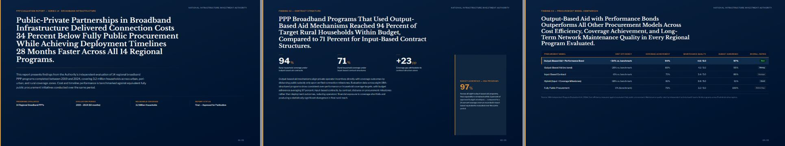

**H03 · executive-dark-bold** — dark — premium · executive · bold — for investor-pitch / keynote — type Syne + Space Grotesk — motion `grain-breathe` — [design.md](knowledge/style/H03/design.md) · [preview.html](knowledge/style/H03/preview.html)

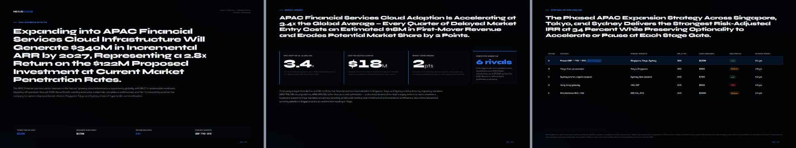

### I · Texture / Organic (4)

**I01 · cream-paper-warm** — light — warm · scholarly · tactile — for seminar / thesis-defense — type Cormorant Garamond + Jost — motion `grain-breathe` — [design.md](knowledge/style/I01/design.md) · [preview.html](knowledge/style/I01/preview.html)

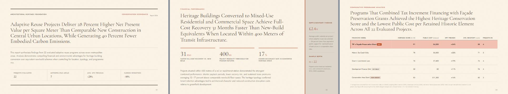

**I02 · wabi-sabi-japanese** — light — zen · minimalist · japanese — for seminar / keynote — type Shippori Mincho + Noto Sans JP — motion `grain-breathe` — [design.md](knowledge/style/I02/design.md) · [preview.html](knowledge/style/I02/preview.html)

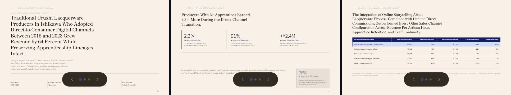

**I03 · warm-film-grain** — dark — nostalgic · cinematic · warm — for keynote / seminar — type Instrument Serif + Space Grotesk — motion `film-grain` — [design.md](knowledge/style/I03/design.md) · [preview.html](knowledge/style/I03/preview.html)

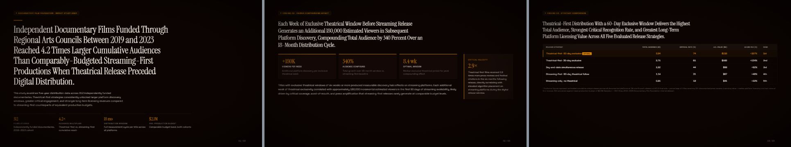

**I04 · soft-bento** — light — modern · playful · structured — for product-launch / team-update — type Nunito + Nunito — motion `gradient-breathe` — [design.md](knowledge/style/I04/design.md) · [preview.html](knowledge/style/I04/preview.html)

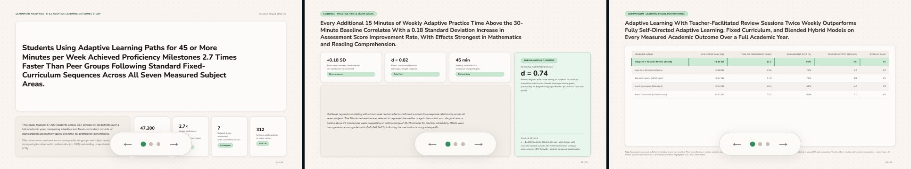

### J · Technical / Engineering (3)

**J01 · terminal-monochrome** — dark — hacker · engineering · retro — for conference-talk / workshop — type JetBrains Mono + JetBrains Mono — motion `circuit-trace` — [design.md](knowledge/style/J01/design.md) · [preview.html](knowledge/style/J01/preview.html)

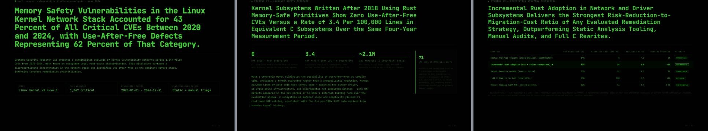

**J02 · data-dashboard** — dark — data · analytical · technical — for conference-talk / group-meeting — type IBM Plex Sans + IBM Plex Mono — motion `particle-float` — [design.md](knowledge/style/J02/design.md) · [preview.html](knowledge/style/J02/preview.html)

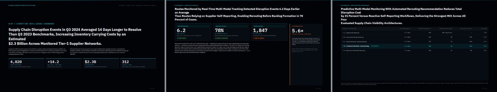

**J03 · light-engineering** — light — precise · technical · engineering — for conference-talk / thesis-defense — type IBM Plex Serif + IBM Plex Sans — motion `light-sweep` — [design.md](knowledge/style/J03/design.md) · [preview.html](knowledge/style/J03/preview.html)

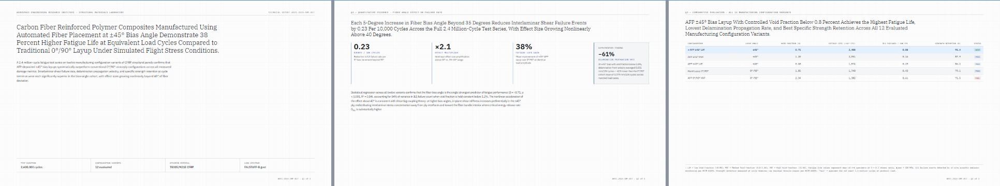

### K · Premium / Luxury (3)

**K01 · monochrome-luxury** — light — luxury · fashion · minimal — for keynote / investor-pitch — type Cormorant Garamond + Jost — motion `light-sweep` — [design.md](knowledge/style/K01/design.md) · [preview.html](knowledge/style/K01/preview.html)

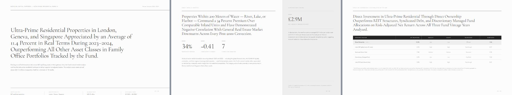

**K02 · gold-dark-premium** — dark — luxury · premium · exclusive — for keynote / investor-pitch — type Playfair Display + Lato — motion `gradient-breathe` — [design.md](knowledge/style/K02/design.md) · [preview.html](knowledge/style/K02/preview.html)

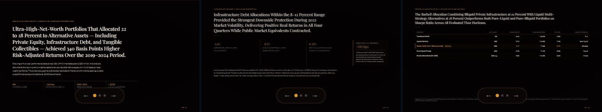

**K03 · dusty-rose-editorial** — light — fashion · editorial · feminine — for keynote / product-launch — type Libre Baskerville + Raleway — motion `gradient-breathe` — [design.md](knowledge/style/K03/design.md) · [preview.html](knowledge/style/K03/preview.html)

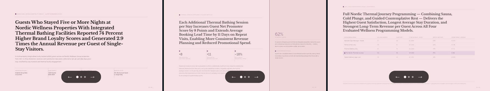

### L · AI / Tech Immersive (3)

**L01 · deep-ai-dark** — dark — ai · futuristic · technical — for conference-talk / keynote — type Syne + Geist Mono — motion `mesh-drift` — [design.md](knowledge/style/L01/design.md) · [preview.html](knowledge/style/L01/preview.html)

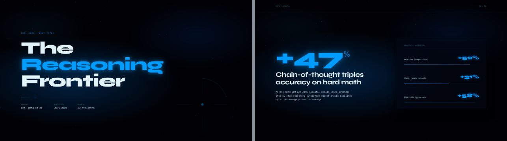

**L02 · purple-ai-immersive** — dark — ai · creative · mysterious — for keynote / product-launch — type Bricolage Grotesque + Geist Mono — motion `mesh-drift` — [design.md](knowledge/style/L02/design.md) · [preview.html](knowledge/style/L02/preview.html)

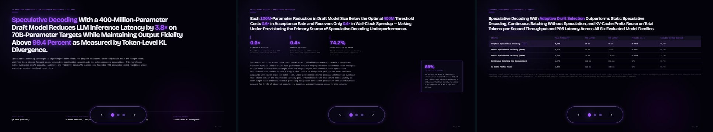

**L03 · teal-ai-light** — light — ai · fresh · modern — for product-launch / conference-talk — type Plus Jakarta Sans + Plus Jakarta Sans — motion `gradient-breathe` — [design.md](knowledge/style/L03/design.md) · [preview.html](knowledge/style/L03/preview.html)

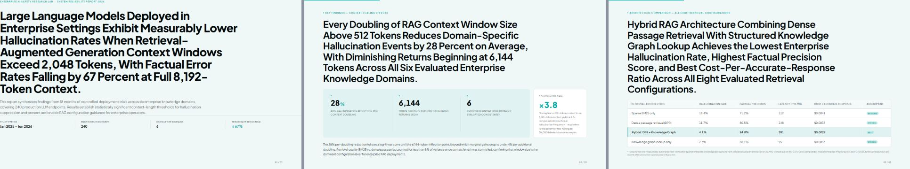

### M · Illustration / Artistic (3)

**M01 · watercolor-wash** — light — artistic · organic · creative — for seminar / keynote — type Playfair Display + Lato — motion `gradient-breathe` — [design.md](knowledge/style/M01/design.md) · [preview.html](knowledge/style/M01/preview.html)

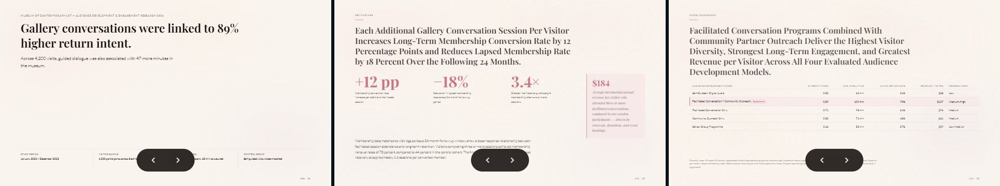

**M02 · ink-illustration** — light — traditional · scholarly · east-asian — for seminar / thesis-defense — type Spectral + Jost — motion `grain-breathe` — [design.md](knowledge/style/M02/design.md) · [preview.html](knowledge/style/M02/preview.html)

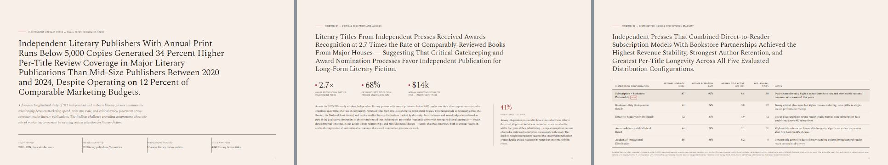

**M03 · risograph-print** — light — retro · print · indie — for keynote / workshop — type Space Grotesk + Space Grotesk — motion `dot-pulse` — [design.md](knowledge/style/M03/design.md) · [preview.html](knowledge/style/M03/preview.html)


### N · Retro / Historical (2)

**N01 · art-deco-gold** — dark — art-deco · luxurious · geometric — for keynote / investor-pitch — type Cinzel + Cormorant Garamond — motion `gradient-breathe` — [design.md](knowledge/style/N01/design.md) · [preview.html](knowledge/style/N01/preview.html)


**N02 · retro-modern-50s** — light — retro · playful · optimistic — for keynote / product-launch — type Bebas Neue + Nunito — motion `light-sweep` — [design.md](knowledge/style/N02/design.md) · [preview.html](knowledge/style/N02/preview.html)


### O · Nature / Earth (2)

**O01 · organic-moss** — dark — organic · nature · environmental — for keynote / seminar — type Lora + Nunito — motion `liquid-blob` — [design.md](knowledge/style/O01/design.md) · [preview.html](knowledge/style/O01/preview.html)


**O02 · sand-dune** — light — warm · expansive · natural — for keynote / seminar — type Fraunces + Plus Jakarta Sans — motion `gradient-breathe` — [design.md](knowledge/style/O02/design.md) · [preview.html](knowledge/style/O02/preview.html)


<!-- GALLERY:END -->

## 动效


14 种背景氛围（`circuit-trace`、`aurora-band`、`starfield-parallax`、`mesh-drift`、`hologram-scan`、`wave-sine`、`shader-grain`、`particle-float`、`gradient-breathe`、`film-grain`、`light-sweep`、`grain-breathe`、`dot-pulse`、`liquid-blob`），以及 `knowledge/motion/motion.md` 里的入场、强调和数据动效片段。全部遵循 `prefers-reduced-motion`，打印时自动关闭。

## 组件


| 演示 | 内容 |
|---|---|
| `knowledge/component/charts-demo.html` | ECharts 折线 / 柱状 / 热力图，颜色取自 deck 的 CSS token |
| `knowledge/component/code-math-demo.html` | highlight.js 代码高亮、KaTeX 公式，算法与推导对照 |
| `knowledge/component/ml-visuals-demo.html` | 手绘 SVG：Transformer 结构、注意力路由、检索增强生成流程，不用任何图片文件 |
| `knowledge/component/presentation-primitives-demo.html` | 数字指标、对比、时间线、引语、数据表 |

## AI 配图（可选，自备 key）


把项目根目录的 `.env.example` 复制为 `.env`（PowerShell：`Copy-Item .env.example .env`；Bash：`cp .env.example .env`），再填入密钥。`.env` 已被 Git 忽略。生图是可选功能：规划、渲染、图表和导出幻灯片都不需要生图密钥。进程环境变量优先于 `.env`。

| 配置项 | AIHubMix 默认值 | 作用 |
|---|---|---|
| `IMAGE_PROVIDER` | 未填写时为 `aihubmix` | 可选 `aihubmix` 或 `openai-compatible` |
| `IMAGE_API_URL` | `https://aihubmix.com/ai/v1/images/generations` | 完整的 POST 接口地址；`openai-compatible` 必填 |
| `IMAGE_API_KEY` | 无 | Bearer 密钥，仅运行 `imagegen.js` 时需要；AIHubMix 仍兼容原有的 `AIHUBMIX_API_KEY` 环境变量 |
| `IMAGE_MODEL` | `gpt-image-2.5-sunburst` | 模型 ID；`openai-compatible` 必填，也可用 `--model` 传入并覆盖配置 |

使用默认 AIHubMix 时，保留 `.env.example` 中的服务商、地址和模型设置，只需填写 `IMAGE_API_KEY`；也可继续在终端设置 `AIHUBMIX_API_KEY`。原生接口仍会读取模型参数定义，自动选用 `size` 或 `aspect_ratio`，轮询异步任务；未开通异步任务时切换到 AIHubMix 同步接口；所选模型失败时重试 `gpt-image-2`。`--no-fallback` 可关闭模型重试。

切换到实现了**同步 OpenAI Images API** `POST /images/generations` 协议的服务时，在 `.env` 中填写：

```dotenv
IMAGE_PROVIDER=openai-compatible
IMAGE_API_URL=https://your-service.example/v1/images/generations
IMAGE_API_KEY=replace-with-your-own-key
IMAGE_MODEL=your-image-model
```

此适配器用 Bearer 密钥发送 `{model,prompt,n:1,size}`，只有指定 `--quality` 时才附加 `quality`；接收 `data[0].b64_json` 或 `data[0].url`。它不提供模型参数查询、异步轮询、模型回退，也不适配 Gemini、Flux 等服务商的原生协议。请求或响应格式不同的服务商需要另写适配器，不能只替换 URL。

```bash
node scripts/imagegen.js "soft aurora over dark sea, empty left third, no text" deck/assets/cover.jpg --size 2048x1152
# 在对象模型的资源 path 中引用图片，然后运行 build-deck.js 打包
```

运行 `node --test scripts/test/imagegen.test.js`，可用本地模拟服务验证 AIHubMix 默认设置、原生接口和自定义 URL 的调用流程，不会产生真实生图费用；测试还会检查服务端错误信息不会泄漏密钥。`imagegen.js` 不会把密钥写入幻灯片或输出到日志。

<details>
<summary><b>模型对比</b>：同一提示词，1536×1024，2026-09-30 实测</summary>


| 模型 | 耗时 | 评价 |
|---|---|---|
| `gpt-image-2.5-sunburst` | ~35 秒 | 构图和细节最好，**默认** |
| `gpt-image-2.5-flare` | ~25 秒 | 画风接近、更快；可能自己加东西 |
| `gpt-image-2` | ~20 秒 | 稳定，**自动兜底** |
| `flux-2-pro` | ~11 秒 | 最快；偏插画风，可能出现乱码数字 |
| `flux-2-flex` | ~15 秒 | 柔和，偏油画感 |
| `gemini-3.1-flash-image` | ~11 秒 | 只接受宽高比（脚本自动换算 `--size`） |
| `qwen-image-2.0-pro` | ~25 秒 | 发灰、对比度低；只出 PNG |

仅支持异步的模型（`flux-2-*`）需要在 AIHubMix 控制台开启异步任务。`imagen-4.0` 和 `doubao-seedream-5.0-pro` 在模型列表里有，但测试账号调用时返回 `model_not_found`。

</details>

## 演示

<table>
<tr>
<td width="50%"></td>
<td width="50%"></td>
</tr>
<tr>
<td><b>演讲者视图</b>：当前页、下一页、演讲者备注、计时器。</td>
<td><b>Studio</b>：缩略图、Deck Plan 备注、全屏、一键打开演讲者视图。</td>
</tr>
</table>

独立 Studio 用 `?preview=N` 加载文稿。Studio 仍是查看器；新文稿在交付 HTML 内的工作台直接编辑。

```
Deck        ← → Space PgUp PgDn   翻页            Home / End   首页 / 末页
            O 页面总览   P 内嵌演讲者视图   B 黑屏
            ?preview=N            只显示第 N 页，无控件
            ?print=1              打印版式
Studio      F 全屏   P 演讲者视图   R 刷新   ? 帮助
演讲者视图   ← → Space PgUp PgDn   翻页   Home / End   B 黑屏
```

Studio 需要用 HTTP 打开 skill 根目录（`npx serve .`），然后访问 `studio/editor.html?deck=/path/to/deck.html`。

## 导出

| 命令 | 结果 |
|---|---|
| `node scripts/check-deck.js deck.html [--json report.json] [--font-fallback]` | 校验运行时及屏幕/打印文字版面；`--font-fallback` 还会在阻断外部字体后复查两种版面 |
| `node scripts/build-deck.js document.json deck.html` | 校验可编辑对象模型，将运行时、工作台、字体和图片打包成单文件 HTML |
| `node scripts/extract-document.js saved.html current.json` | 从用户保存的 HTML 提取最新模型供 AI 继续修改 |
| `node scripts/inline-assets.js old.html [out.html]` | 仅供旧文稿内联资源 |
| `node scripts/export-pdf.js deck.html [out.pdf]` | **PDF**，16:9，每页一张 1920×1080；写出前检查打印版面文字 |
| `node scripts/export-pptx.js deck.html [out.pptx]` | **默认可编辑 PPTX**：原生对象、备注、输入哈希与逐对象转换清单 |
| `node scripts/export-pptx.js deck.html [out.pptx] --image` | **图片版 PPTX**：每页一张整图 |
| `node scripts/export-helper.js` | 为工作台当前未保存快照提供本地导出助手 |
| `node scripts/imagegen.js "<prompt>" out.jpg` | 通过已配置的服务生成装饰性配图 |

## 目录结构

```
SKILL.md              入口：Agent 遵循的 8 步流程
knowledge/
  RUNTIME.md          deck 运行时合同：舞台、翻页、?preview、打印
  element/            字号、密度、留白
  component/          图表 · 代码与公式 · ML 示意图 · 基础组件（含可运行演示）
  style/              53 × { design.md, preview.html } + index.json
  motion/             背景氛围、入场 / 强调 / 数据动效
prompts/              Deck Plan JSON schema
scripts/              build-deck · extract-document · check-deck · export-pdf · export-pptx · export-helper · imagegen
workbench/            内嵌编辑器运行时与独立界面样式
studio/               editor.html（查看器）· presenter.html
assets/fonts/         内置中文和等宽字体（SIL OFL 1.1）
docs/readme/          仅用于 README 的图片，运行时不需要
SOURCES.md            所有外部资源的版本与许可证
```

## 设计理念

- **教设计，不给模板。** 一种风格是一组理由（token、层级、节奏），Agent 可以把它用在从没见过的内容上。
- **论点先行。** 每页标题都是一个完整句子的论点，正文是它的证据。
- **让人做反应。** 真实的动态预览胜过一堆形容词。
- **合同胜过约定。** 一个很小的运行时 API，让每个 deck 都可校验、可演示、可导出。
- **单文件更长寿。** 必经打包命令把工作台和本地资源写入一份可移动的 HTML。

## 许可证

本仓库代码和文档采用 [MIT](LICENSE)。内置字体采用 SIL OFL 1.1；CDN 库保留各自的许可证（见 [SOURCES.md](SOURCES.md)）。
付费平台（Gamma、Pitch、Magic UI Pro、Aceternity Pro 等）仅作视觉参考，未使用其任何代码或素材。
